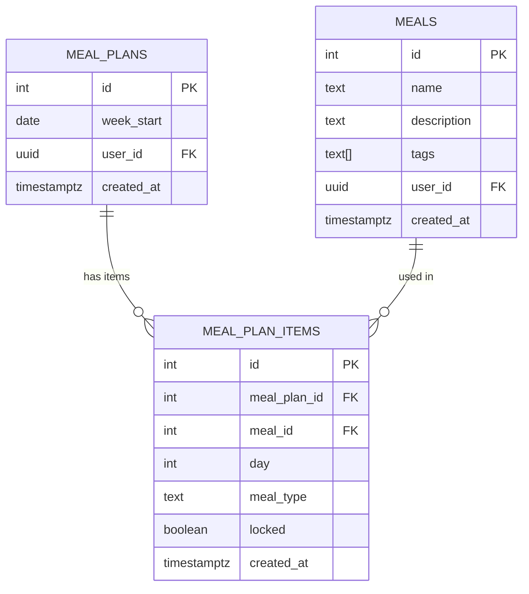

# PRD: MyMenu — Plánovač jídel pro rodinu

## Problém
Rodina se 4 členy (malé děti) nestíhá večer vařit a hlavně vymýšlet, co se bude daný den jíst. Potřebují jednoduchou appku, která z předdefinovaného seznamu jídel automaticky naplánuje vyvážený týdenní jídelníček.

## Cílový uživatel
Rodič, který spravuje jídelníček pro rodinu — zadává jídla, generuje a upravuje týdenní plán.

## User Stories
- Jako rodič chci spravovat katalog jídel, která umíme uvařit, abych měl přehled co můžeme jíst
- Jako rodič chci jedním klikem vygenerovat týdenní plán (obědy + večeře, Po-Ne), abych nemusel každý den vymýšlet co vařit
- Jako rodič chci vidět aktuální týdenní plán přehledně na mobilu i desktopu
- Jako rodič chci vyměnit konkrétní jídlo v plánu za jiné, když se mi nelíbí návrh
- Jako rodič chci regenerovat jídlo pro konkrétní den/slot bez ovlivnění zbytku plánu

## Pravidla plánování
- Žádné dva stejné jídla dva dny po sobě
- Vyvážené rozložení — ne celý týden maso (střídat masová a bezmasá jídla)
- Neopakovat stejné jídlo v rámci jednoho týdne

## MVP Scope

### In scope
- CRUD katalog jídel (název, popis, tagy — rychlé, dětské, maso, bezmasé, těstoviny...)
- Automatické generování týdenního plánu (obědy + večeře, Po-Ne) z katalogu
- Zobrazení aktuálního týdenního plánu — přehledně, mobile-first
- Ruční výměna jídla v plánu (swap za jiné z katalogu)
- Regenerace konkrétního dne/jídla (zamknuté sloty se nepřepisují)
- Suroviny u jídel (název, množství, jednotka)
- Nákupní seznam z týdenního plánu (agregace surovin, odškrtávání)

### Out of scope
- Přihlašování / multi-user (zatím single household)
- Recepty / postup přípravy
- Nutriční informace
- AI-powered plánování (zatím random s pravidly)

## Datový model

### Tabulka: meals
| Sloupec | Typ | Popis |
|---------|-----|-------|
| id | integer (PK, identity) | Unikátní ID jídla |
| name | text | Název jídla |
| description | text (nullable) | Krátký popis |
| tags | text[] | Tagy pro filtrování a plánování (maso, bezmasé, rychlé, dětské...) |
| user_id | uuid → auth.users | Vlastník záznamu |
| created_at | timestamptz | Čas vytvoření |

### Tabulka: meal_plans
| Sloupec | Typ | Popis |
|---------|-----|-------|
| id | integer (PK, identity) | Unikátní ID plánu |
| week_start | date | Pondělí daného týdne |
| user_id | uuid → auth.users | Vlastník plánu |
| created_at | timestamptz | Čas vytvoření |

### Tabulka: meal_plan_items
| Sloupec | Typ | Popis |
|---------|-----|-------|
| id | integer (PK, identity) | Unikátní ID položky |
| meal_plan_id | integer → meal_plans | Odkaz na týdenní plán |
| meal_id | integer → meals | Odkaz na jídlo |
| day | integer | Den v týdnu (0=Po, 6=Ne) |
| meal_type | text | Typ jídla (oběd/večeře) |
| locked | boolean | Zamknutý slot — regenerace ho přeskočí |
| created_at | timestamptz | Čas vytvoření |

## Diagram vztahů



## SQL pro Supabase

```sql
-- Spusť v Supabase SQL Editoru (DEV projekt)
-- Až budeš deployovat, stejný SQL spustíš i v PROD projektu

CREATE TABLE meals (
  id integer generated always as identity primary key,
  name text not null,
  description text,
  tags text[] not null default '{}',
  user_id uuid references auth.users(id),
  created_at timestamptz not null default now()
);

ALTER TABLE meals ENABLE ROW LEVEL SECURITY;
CREATE POLICY "meals_allow_all" ON meals FOR ALL USING (true) WITH CHECK (true);

CREATE TABLE meal_plans (
  id integer generated always as identity primary key,
  week_start date not null,
  user_id uuid references auth.users(id),
  created_at timestamptz not null default now()
);

ALTER TABLE meal_plans ENABLE ROW LEVEL SECURITY;
CREATE POLICY "meal_plans_allow_all" ON meal_plans FOR ALL USING (true) WITH CHECK (true);

CREATE TABLE meal_plan_items (
  id integer generated always as identity primary key,
  meal_plan_id integer not null references meal_plans(id) on delete cascade,
  meal_id integer not null references meals(id) on delete cascade,
  day integer not null check (day >= 0 and day <= 6),
  meal_type text not null check (meal_type in ('oběd', 'večeře')),
  locked boolean not null default false,
  created_at timestamptz not null default now()
);

ALTER TABLE meal_plan_items ENABLE ROW LEVEL SECURITY;
CREATE POLICY "meal_plan_items_allow_all" ON meal_plan_items FOR ALL USING (true) WITH CHECK (true);
```
